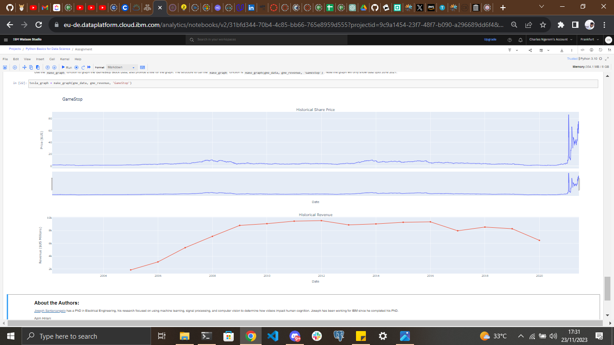

# Extracting and Visualizing Stock Data

## Description

Data analysis is a crucial aspect of data science, enabling individuals to make informed decisions based on extracted and visualized insights. This project focuses on extracting essential stock data, utilizing pandas, yfinance, and requests for web scraping. The extracted data is then presented through meaningful visualizations, offering insights into the stock history and revenue of Tesla and GameStop.

## Table of Contents

- [Installation](#installation)
- [Usage](#usage)
- [Dependencies](#dependencies)
- [Data Sources](#data-sources)
- [Features](#features)
- [Examples](#examples)
- [Contributing](#contributing)

## Installation

Ensure you have Python installed on your machine. Use the package manager [pip](https://pip.pypa.io/en/stable/) to install the required libraries:

```bash
pip install pandas yfinance requests matplotlib jupyter-notebook
```

## Usage
Execute the main script to perform data extraction and visualization:

```bash
jupyter-notebook
```

## Dependencies

Pandas: Data manipulation library
yfinance: Yahoo Finance API for stock data
requests: Library for making HTTP requests
matplotlib: Data visualization library

## Data Sources
The project utilizes data from the following sources:

Yahoo Finance: Stock data source

## Features
Data extraction from Tesla and GameStop stock data
Visualization of stock history and revenue trends
Customizable parameters for analysis

## Examples
## Examples


*Caption: Description of the stock history visualization.*


*Caption: Description of the revenue trends visualization.*


## Contributing
Fork the repository
Create a new branch (git checkout -b feature/new-feature)
Commit your changes (git commit -am 'Add new feature')
Push to the branch (git push origin feature/new-feature)
Create a pull request
